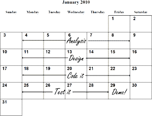
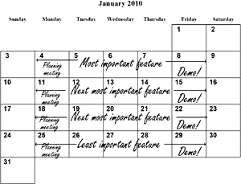

# 极限编程项目要素

在传统的项目流程中，我们一个接一个地安排团队的活动（activity），从项目启动直至结束：先做分析，然后做设计，接着再编码、测试，诸如此类。我们制定这样一个时间排期，目标是在项目结束时所有工作都已完成。排期临近结束时，我们向客户展示新的软件，希望客户喜欢。

按照这种项目流程，项目的每个阶段开展不同的活动，需要用到不同的专业能力，因此每个阶段结束后，就可以释放当前的专业团队，由不同的团队来接手项目的下一阶段。然而大多数项目并不能真正享受到这种分工带来的效率，因为项目结束之前需求还会改变，结果负责前面阶段的团队不得不再次涉入项目工作中。

极限编程、Scrum等敏捷过程则坦承“需求会改变”这一事实。需求的改变，可以提升软件水平，创造竞争优势。作为软件开发的专业人士，我们不应该寄望于“需求不会变化”。在我们看来，客户的需求其实是在讲述一个**[用户的故事](user-story.md)**，以“故事卡”这种低成本的方式框定一个项目的范围，而不必提前耗费大量成本进行详尽的需求分析。

在项目进行过程中，我们把用户故事作为基本单元，针对每个故事依次开展所有活动，让每个故事尽快流动到可以交付的状态。由于项目不再划分成泾渭分明的若干阶段，团队也不再按照专业职能分割。各种专业职能的人员组合成全功能团队，自发地以合适的人员和技能组合去推动故事的流动。这正是自组织团队的精髓与益处。

于是我们的项目排期也发生了彻底的变化：我们把用户故事按重要性排序，就得到了项目排期。**这给了我们另一种效率：我们可以随时改变心意，而不会造成太大的成本损失。**我们甚至可以随时中止项目，在此之前交付的最重要的故事仍然是可用的。

按照用户故事进行项目排期，管理者就可以评估每个功能特性的成本，而不是每项活动的成本。有了这项信息，客户就可以更明智地判断：何时应该停止，哪些功能特性不需要开发。客户不用把有限的资源（不仅是金钱，还有——更重要的——时间）浪费在分析和设计那些并不重要的功能特性上。由于省去了这些本不应该发生的活动，成本的使用会更有意义。

作为非专业人士，客户没有能力选择应该开展哪些活动、可以省略哪些活动。所以我们要以“购物列表”的形式，在需求的维度上选择和做计划。
